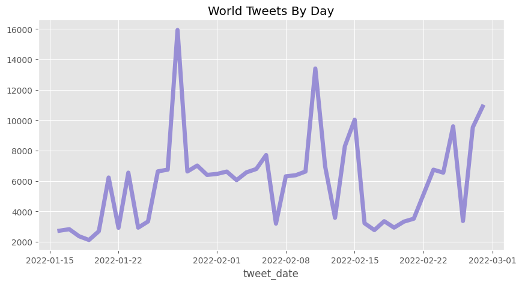
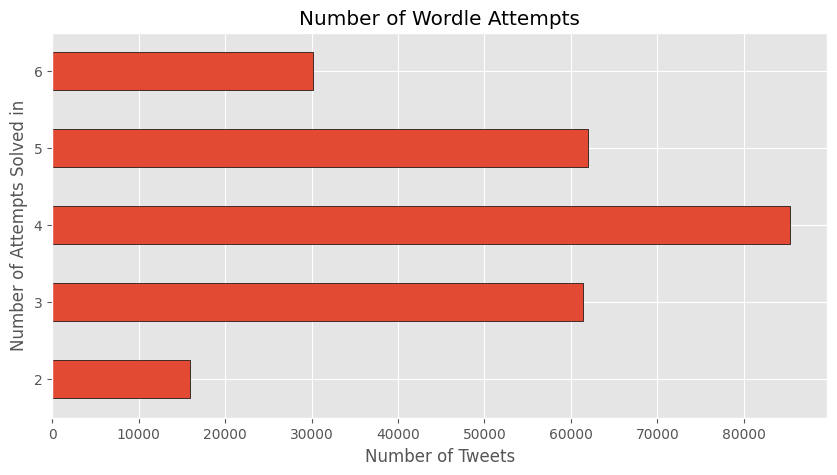
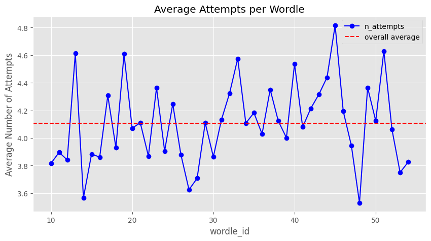

# Data-Science-Learning 
contains practice work, follow-along projects & tutorials, notes & references 

Wordle Tweet Dataset EDA by Rob Mulla (tutorial)
   Dataset by Ben Hamner
   Graphs:
   
   

   Graphs by me:
   
