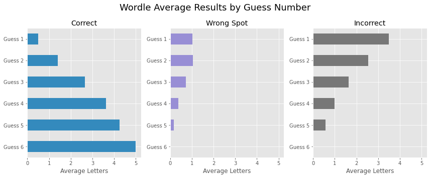
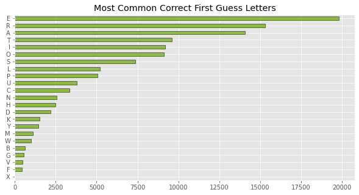

# Data-Science-Learning 
contains practice projects, tutorials, learning notes

Wordle DataSet EDA- tutorial by Rob Mulla: https://www.kaggle.com/code/robikscube/wordle-tweet-dataset-eda-4-youtube 
Letter and attempt number analysis graph references:

